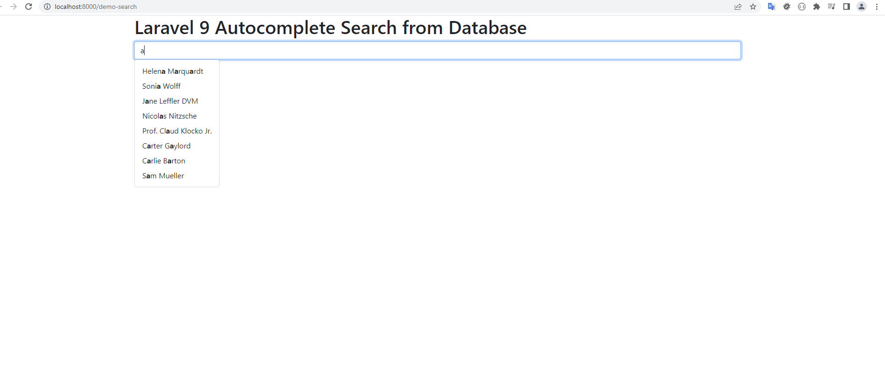

# laravel9_autocomplete_search_using_typeahead_js
## 1: Install Laravel 9
```Dockerfile
composer create-project laravel/laravel laravel9_autocomplete_search_using_typeahead_js
```
## 2: Add Dummy Users
```Dockerfile
php artisan migrate
```
- Chạy 
```Dockerfile
php artisan tinker
User::factory()->count(20)->create()
```
## 3: Create Controller
-  Vào app/Http/Controllers/SearchController.php
```Dockerfile
<?php
  
namespace App\Http\Controllers;
  
use Illuminate\Http\Request;
use App\Models\User;
  
class SearchController extends Controller
{
    /**
     * Display a listing of the resource.
     *
     * @return \Illuminate\Http\Response
     */
    public function index()
    {
        return view('searchDemo');
    }
    
    /**
     * Show the form for creating a new resource.
     *
     * @return \Illuminate\Http\Response
     */
    public function autocomplete(Request $request)
    {
        $data = User::select("name")
                    ->where('name', 'LIKE', '%'. $request->get('query'). '%')
                    ->get();
     
        return response()->json($data);
    }
}
```
## 4: Create Routes
- routes/web.php
```Dockerfile
<?php
  
use Illuminate\Support\Facades\Route;
  
use App\Http\Controllers\SearchController;
  
/* 
|--------------------------------------------------------------------------
| Web Routes
|--------------------------------------------------------------------------
|
| Here is where you can register web routes for your application. These
| routes are loaded by the RouteServiceProvider within a group which
| contains the "web" middleware group. Now create something great!
|
*/
  
Route::controller(SearchController::class)->group(function(){
    Route::get('demo-search', 'index');
    Route::get('autocomplete', 'autocomplete')->name('autocomplete');
});
```
## 5: Create View File
- Vào resources/views/searchDemo.blade.php
```Dockerfile
<!DOCTYPE html>
<html>
<head>
    <title>Laravel 9 Autocomplete Search from Database</title>
    <link href="https://cdn.jsdelivr.net/npm/bootstrap@5.0.2/dist/css/bootstrap.min.css" rel="stylesheet" integrity="sha384-EVSTQN3/azprG1Anm3QDgpJLIm9Nao0Yz1ztcQTwFspd3yD65VohhpuuCOmLASjC" crossorigin="anonymous">
    <script src="http://ajax.googleapis.com/ajax/libs/jquery/1.9.1/jquery.js"></script>
    <script src="https://cdnjs.cloudflare.com/ajax/libs/bootstrap-3-typeahead/4.0.1/bootstrap3-typeahead.min.js"></script>
</head>
<body>
     
<div class="container">
    <h1>Laravel 9 Autocomplete Search from Database - ItSolutionStuff.com</h1>   
    <input class="typeahead form-control" id="search" type="text">
</div>
     
<script type="text/javascript">
    var path = "{{ route('autocomplete') }}";
  
    $('#search').typeahead({
            source: function (query, process) {
                return $.get(path, {
                    query: query
                }, function (data) {
                    return process(data);
                });
            }
        });
  
</script>
     
</body>
</html>
```
## 6: Run Laravel App:
```Dockerfile
php artisan serve
```
- Vào http://localhost:8000/demo-search


